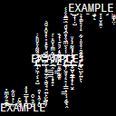

# [zalgo-py](https://github.com/kenny-kvibe/zalgo-py)

> Transform text by combining certain characters

## Usage

```py
# :module `zalgo`:
#  :funct `transform`:
#   :param `text`: string – text to process
#   :param `strength`: string – "normal", "small", "big", "extreme"
#   :param `position`: string – "above", "middle", "below", "random", "all"
#   :param `text_concat`: string – "before", "after", "random", "all"

import zalgo
print(zalgo.transform('EXAMPLE', 'normal', 'random', 'after'))

```


